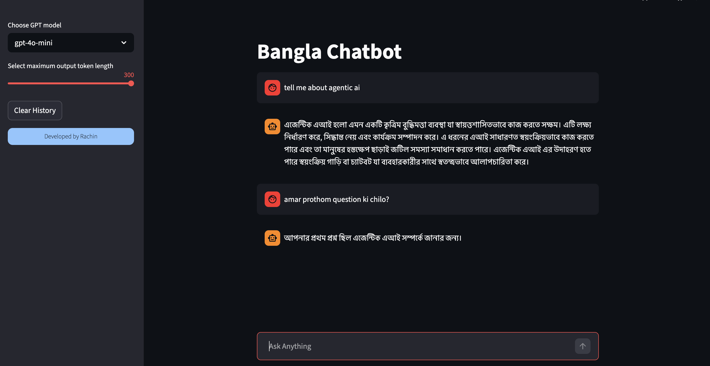

# 🌍 Bangla Chatbot

> A conversational AI chatbot that always replies in **Bengali (Bangla)** — no matter if you type in English, Banglish, or Bangla.

[](https://bangla--chatbot.streamlit.app/)
[](https://python.org)
[](https://streamlit.io)
[](https://openai.com)

---

## 📌 Overview

**Bangla Chatbot** is a simple, clean conversational chatbot powered by OpenAI GPT models. It accepts input in **English, Banglish, or Bangla** and always responds in pure **Bangla** — making it accessible and natural for Bengali speakers.

---

## ✨ Features

- 🗣️ **Multilingual Input** — Ask questions in English, Banglish, or Bangla
- 🔁 **Always Replies in Bangla** — Responses are strictly in Bengali, no mixed language
- 🧠 **Conversation Memory** — Remembers chat history within the session
- ⚡ **Streaming Responses** — Answers appear word by word in real time
- 🎛️ **Model Selector** — Switch between `gpt-4o-mini` and `gpt-5-nano` from the sidebar
- 📏 **Token Length Control** — Adjust response length with a slider (50–300 tokens)
- 🗑️ **Clear History** — Reset the conversation anytime with one click
- ☁️ **Streamlit Cloud Ready** — Secrets management built in for easy deployment

---

## 🛠️ Tech Stack

| Layer | Technology |
|---|---|
| UI | [Streamlit](https://streamlit.io) |
| LLM | OpenAI GPT (`gpt-4o-mini`, `gpt-5-nano`) |
| Framework | [LangChain](https://langchain.com) |
| Memory | `ChatMessageHistory` (session-based) |
| Streaming | LangChain `RunnableWithMessageHistory` |

---

## 🚀 Getting Started

### 1. Clone the repository

```bash
git clone [https://github.com/your-username/bangla-chatbot.git](https://github.com/Rachin02/Bangla-Chatbot)
cd bangla-chatbot
```

### 2. Create and activate a virtual environment

```bash
python -m venv venv
source venv/bin/activate        # macOS/Linux
venv\Scripts\activate           # Windows
```

### 3. Install dependencies

```bash
pip install -r requirements.txt
```

### 4. Set up your API key

Create a `.env` file in the root directory:

```env
OPENAI_API_KEY=your_openai_api_key_here
```

> **Note:** If running locally, remove or comment out this line from `app.py`:
> ```python
> os.environ["OPENAI_API_KEY"] = st.secrets["OPENAI_API_KEY"]
> ```
> That line is only needed for Streamlit Cloud deployment.

### 5. Run the app

```bash
streamlit run app.py
```

---

## ☁️ Deploying to Streamlit Cloud

1. Push your code to GitHub
2. Go to [streamlit.io/cloud](https://streamlit.io/cloud) and connect your repo
3. Under **App Settings → Secrets**, add:
   ```toml
   OPENAI_API_KEY = "your_openai_api_key_here"
   ```
4. Deploy — done!

---

## 📁 Project Structure

```
├── app.py              # Main Streamlit application
├── .env                # Environment variables (not committed)
├── requirements.txt    # Python dependencies
└── README.md
```

---

## 📸 Screenshot
   

---

## 🙋‍♂️ Author

**Rachin**

---

## 📄 License

This project is open-source and available under the [MIT License](LICENSE).
